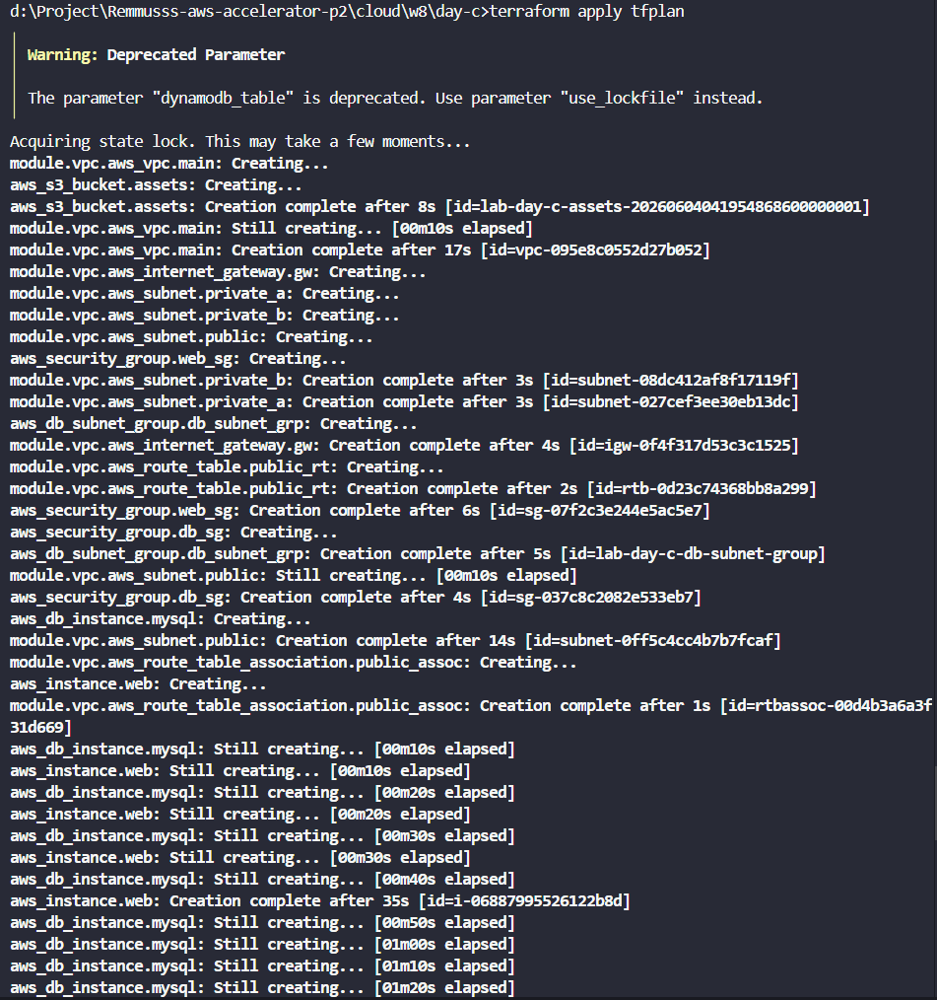
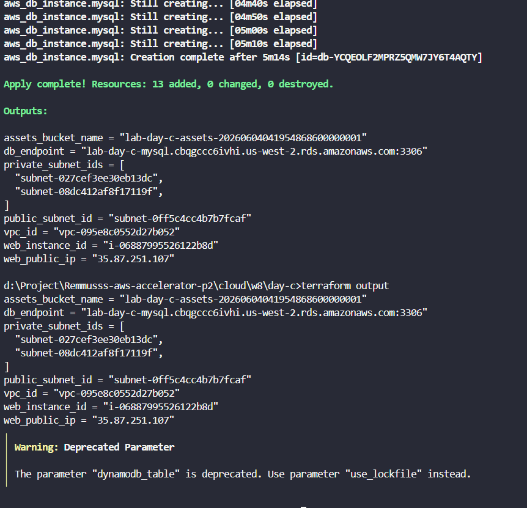
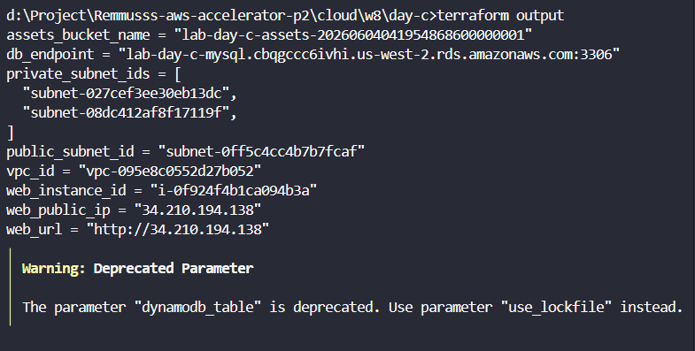
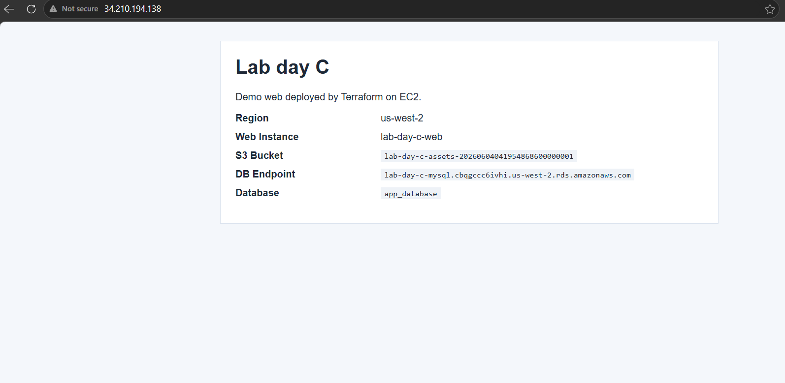

# Day C Evidence

- Terraform apply result after provisioning the AWS resources.

---
- Additional Terraform apply output showing the deployment completed successfully.

---
- Terraform outputs including the VPC, subnets, EC2 instance, RDS endpoint, S3 bucket, and web URL.

---
- The demo web page served from the EC2 instance after deployment.

