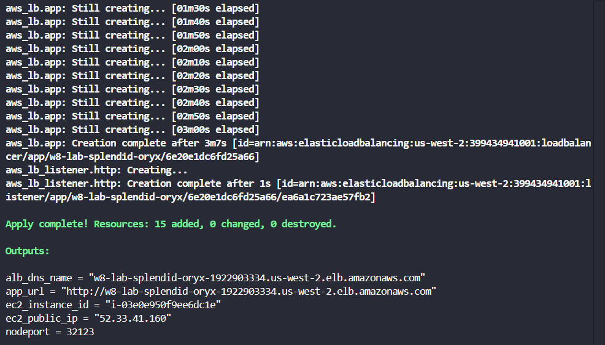
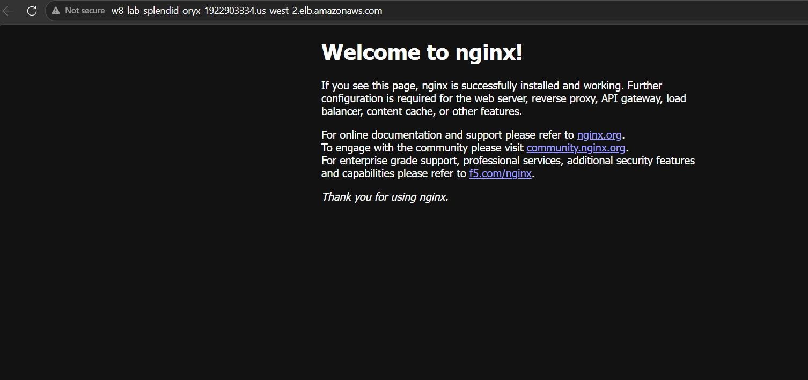

# W8 Lab

## Architecture

```text
Internet (HTTP :80)
    ↓
ALB public (Multi-AZ)
├─ Public Subnet A: 10.20.1.0/24 (us-west-2a)
└─ Public Subnet B: 10.20.2.0/24 (us-west-2b)
    ↓ HTTP to EC2 host port 32123
EC2 (t3.medium, public subnet A)
    ↓ Docker + kubectl + minikube
minikube cluster
    ↓ host bridge
kubectl port-forward svc/demo-web 32123:80
    ↓
Kubernetes Service demo-web (NodePort 32123)
    ↓
Deployment demo-web
└─ nginx Pods
    ↓
Nginx web page
```

## Providers

- `hashicorp/aws`
- `hashicorp/random`

## Quick Run
```powershell
cd cloud/w8/lab

terraform init
terraform plan -out tfplan
terraform apply tfplan

terraform output
```

## Cleanup

```powershell
terraform destroy
```

## Evidence

Apply completed


Web page
