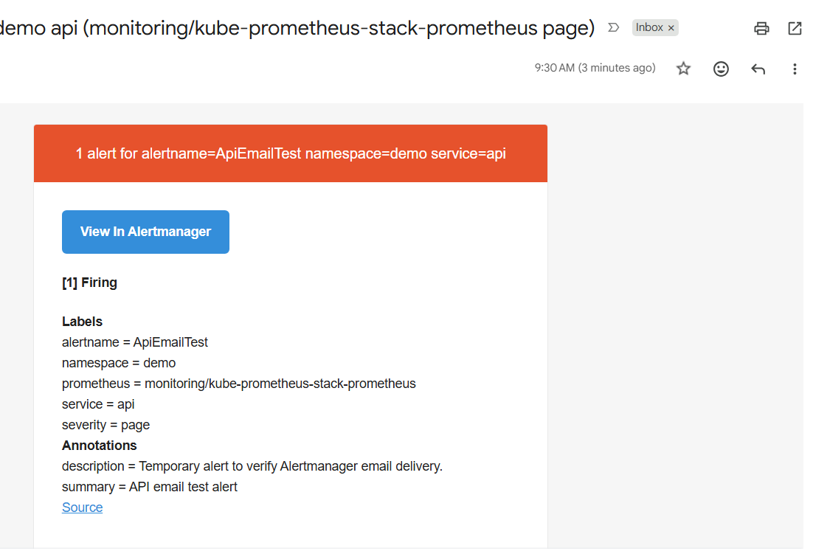
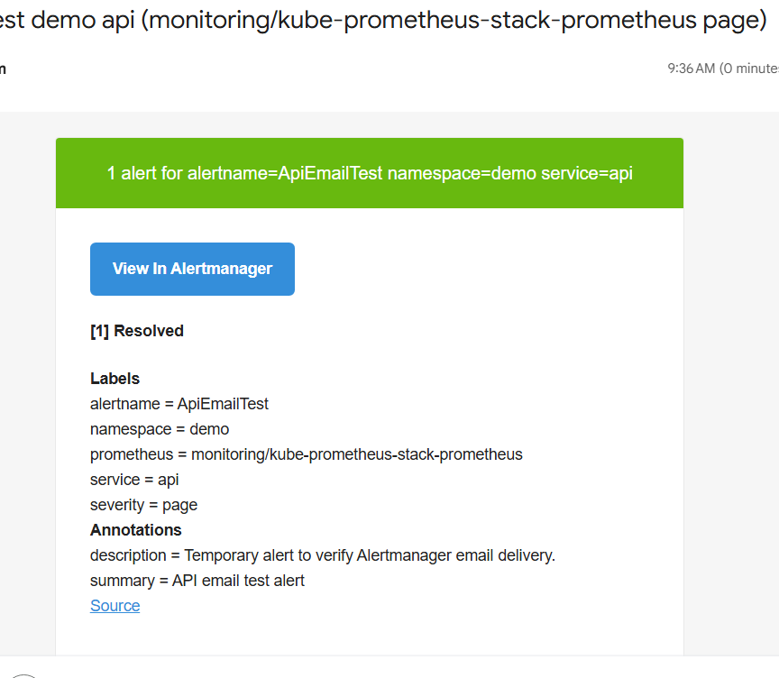
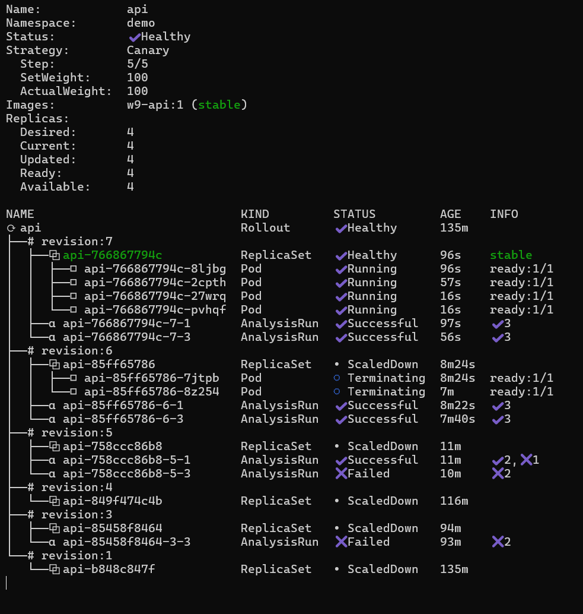
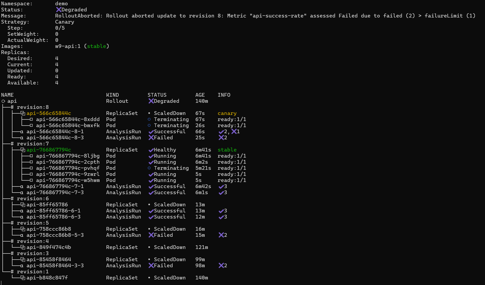

# W9 Lab Evidence

## 1. Email Alert Firing Thành Công



Ảnh `alert-email.png` chứng minh Alertmanager đã gửi email khi alert ở trạng thái `Firing`.


## 2. Email Alert Resolved Thành Công



Ảnh `auto-abort-email.png` cho thấy Alertmanager gửi email khi alert chuyển sang trạng thái `Resolved`.

## 3. Canary Rollout Thành Công



Ảnh `succesful-auto-rollouts.png` chứng minh Rollout `api` đã promote canary thành công.


## 4. Canary Rollout Tự Động Abort Khi Metric Fail



Ảnh `auto-abort-rollout.png` chứng minh Rollout `api` đã tự động abort khi analysis fail.


## 5. Liên Hệ Evidence Với Cấu Hình Trong Repo

### Argo Rollouts

Manifest chính:

`cloud/w9/lab/gitops/k8s-api/api.yaml`

Rollout dùng canary strategy:

- `setWeight: 25`
- chạy analysis `api-success-rate`
- `setWeight: 50`
- chạy analysis `api-success-rate`
- `setWeight: 100`

Evidence liên quan:

- `succesful-auto-rollouts.png`: canary pass và promote 100%.
- `auto-abort-rollout.png`: canary fail và bị abort.

### AnalysisTemplate

Manifest chính:

`cloud/w9/lab/gitops/k8s-api/analysis-template.yaml`

Metric được kiểm tra:

```promql
(
  sum(rate(flask_http_request_total{namespace="demo", service="api", status!~"5.."}[1m]))
  /
  sum(rate(flask_http_request_total{namespace="demo", service="api"}[1m]))
) or vector(1)
```

Điều kiện pass:

```yaml
successCondition: result[0] >= 0.95
```

Failure policy:

```yaml
failureLimit: 1
```

Evidence liên quan:

- Ảnh rollout abort cho thấy metric `api-success-rate` failed vượt `failureLimit`.
- Ảnh rollout thành công cho thấy các AnalysisRun thành công.

### PrometheusRule Và Alertmanager

Manifest chính:

`cloud/w9/lab/gitops/k8s-api/prometheus-rule.yaml`

Alert chính:

```yaml
alert: ApiSLOViolation
```

Label quan trọng:

```yaml
namespace: demo
service: api
severity: page
```

Cấu hình Alertmanager local:

`cloud/w9/lab/secrets/apply-alertmanager-secret.ps1`

Alertmanager route match:

```yaml
matchers:
  - namespace="demo"
  - alertname=~"Api.*"
```

Evidence liên quan:

- `alert-email.png`: email firing.
- `auto-abort-email.png`: email resolved.

## 6. Các Lệnh Kiểm Chứng Tương Ứng

Kiểm tra Argo CD apps:

```powershell
kubectl -n argocd get applications
```

Kiểm tra rollout API:

```powershell
kubectl-argo-rollouts.exe get rollout api -n demo
```

Watch rollout khi test canary:

```powershell
kubectl-argo-rollouts.exe get rollout api -n demo --watch
```

Kiểm tra AnalysisRun:

```powershell
kubectl -n demo get analysisrun --sort-by=.metadata.creationTimestamp
```

Kiểm tra PrometheusRule:

```powershell
kubectl -n demo get prometheusrule api-slo-rules
```

Kiểm tra ServiceMonitor:

```powershell
kubectl -n demo get servicemonitor api
```

Kiểm tra Alertmanager Secret:

```powershell
kubectl -n monitoring get secret alertmanager-private-config
```